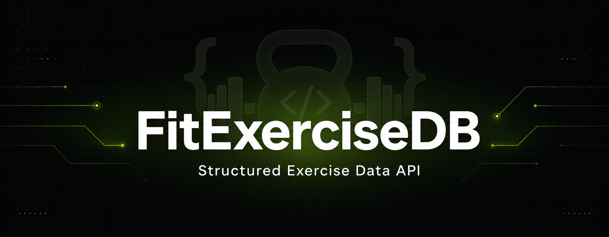
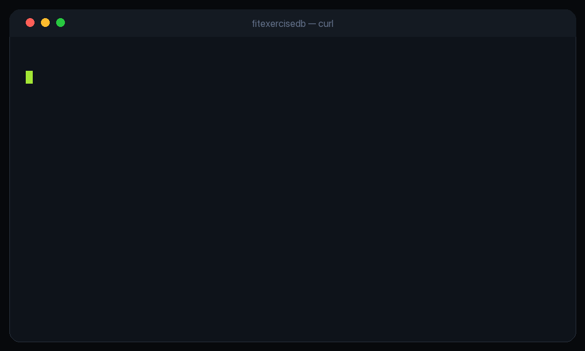

<div align="center">



<br /><br />

### 🏋️ The Exercise Database API for developers

**1,324 structured exercises** · **Sub-50ms, EU-hosted** · **Rate-limited & abuse-protected**

<p>
  <a href="https://fitexercisedb.com"></a>
  <a href="https://fitexercisedb.com"></a>
  <a href="#-api-reference"></a>
  <a href="#-pricing"></a>
</p>

<sub>🔑 Sign up, subscribe, and manage your API keys at <a href="https://fitexercisedb.com"><b>fitexercisedb.com</b></a></sub>

<p>
  
  
  
  
  
</p>

</div>

---

## 🏋️ FitExerciseDB API

**FitExerciseDB** is a developer-friendly **exercise database REST API** for building fitness, workout, gym, and health apps. It serves a curated catalog of **1,324 structured exercises**, each annotated with target muscles, equipment, and step-by-step instructions, as clean, paginated JSON. If you have been looking for an **ExerciseDB alternative** with predictable EUR pricing and data that actually stays yours, this is it.

Skip the scraping, the messy CSVs, and the licensing headaches. Wire up one clean API and get back to building.

### 🌟 Why developers pick FitExerciseDB

- ✅ **1,324 structured exercises** with consistent, typed fields
- 🔎 **Full-text search** across the whole catalog, ranked, one query param
- 🏷️ **Clean taxonomies** for body parts, equipment, and target muscles
- 🔑 **Dead-simple auth** — one bearer API key, hashed with argon2id
- 📊 **Predictable limits** — `X-RateLimit-*` headers on every response
- 🧩 **Errors you can code against** — RFC 7807 `application/problem+json`
- 🇪🇺 **EU-hosted, GDPR-friendly** — daily-salted IP hashing, no PII in logs
- 🛡️ **Abuse-protected by design** — per-key rate limits, leak forensics, and usage logging keep the dataset yours
- 💶 **Fair, flat EUR pricing** — no per-call overage surprises

**Perfect for:**

- 💪 Fitness and workout app developers
- 🏃 Health and wellness platforms
- 🎯 Personal training and coaching tools
- 📱 Gym and exercise-logging apps
- 🔬 Fitness research and data projects

---

## ⚡ Quick start

<div align="center">
  
</div>

```bash
curl https://api.fitexercisedb.com/v1/exercises/0001 \
  -H "Authorization: Bearer fed_live_YOUR_KEY"
```

```json
{
  "id": "0001",
  "name": "3/4 sit-up",
  "bodyPart": "waist",
  "target": "abs",
  "equipment": "body weight",
  "secondaryMuscles": ["hip flexors", "lower back"],
  "instructions": [
    "Lie flat on your back with your knees bent and feet flat on the ground.",
    "Place your hands behind your head with your elbows pointing outwards.",
    "Curl your upper body up toward your knees, then lower back down."
  ]
}
```

Every authenticated response also carries your live quota:

```
X-RateLimit-Limit:     100000
X-RateLimit-Remaining: 99984
X-RateLimit-Reset:     2026-08-01
```

---

## 📚 API reference

Base URL: `https://api.fitexercisedb.com`  ·  All `/v1/*` routes require `Authorization: Bearer fed_live_<key>`.

| Method | Endpoint | Description |
| --- | --- | --- |
| `GET` | `/health` | Liveness check (no auth) |
| `GET` | `/v1/exercises` | Paginated list. Filter by `bodyPart`, `target`, `equipment`. `pageSize` up to 100 |
| `GET` | `/v1/exercises/:id` | A single exercise by id (e.g. `0001`) |
| `GET` | `/v1/exercises/search?q=` | Ranked full-text search |
| `GET` | `/v1/bodyparts` | Body-part taxonomy |
| `GET` | `/v1/equipment` | Equipment taxonomy |
| `GET` | `/v1/targets` | Target-muscle taxonomy |
| `GET` | `/v1/me` | Your tier, quota used, and reset date |

### Data model

Each exercise returns: `id`, `name`, `bodyPart`, `target`, `equipment`, `secondaryMuscles[]`, and `instructions[]`. Facts about movements, delivered as clean JSON.

---

## 🛡️ Abuse protection, built in

Most exercise datasets get scraped once and passed around forever. FitExerciseDB ships with real protection so a single subscription cannot silently become everyone's copy:

- **Per-key token bucket** — atomic Redis rate limiting, enforced before the database is touched.
- **Sequential-scan detection** — walking ids in order on the free tier triggers progressive delays, then a hard stop.
- **Canary perturbation** — every response is invisibly fingerprinted per key, so any leaked dump traces straight back to its source.
- **Usage forensics** — every authenticated request is logged with a daily-salted IP hash, GDPR-friendly by design.

---

## 💶 Pricing

Start free, upgrade when your app grows. Annual billing saves 20 percent.

| Tier | Monthly | Annual | Quota / month | Burst |
| --- | --- | --- | --- | --- |
| **Free** | €0 | — | 100 | 2 req/s |
| **Starter** | €9 | €86 | 10,000 | 10 req/s |
| **Pro** | €29 | €278 | 100,000 | 50 req/s |
| **Scale** | €99 | €950 | 1,000,000 | 200 req/s |

The free tier needs only a 30-second email signup and is enough to verify your integration end to end.

---

## 🆚 FitExerciseDB vs other exercise APIs

| | FitExerciseDB | Typical scraped dataset |
| --- | --- | --- |
| Structured, typed JSON | ✅ | ⚠️ inconsistent |
| Full-text search endpoint | ✅ | ❌ |
| Predictable flat EUR pricing | ✅ | ❌ per-call marketplaces |
| EU-hosted, GDPR-friendly | ✅ | ❓ |
| Anti-scrape + leak forensics | ✅ | ❌ |
| Stable RFC 7807 errors | ✅ | ❌ |

---

## 🗺️ Roadmap

**Available now:** structured exercise metadata API (list, search, taxonomies, usage).

**Planned:**
- Official SDKs on npm and PyPI
- OpenAPI 3.1 spec + hosted API playground
- Webhooks for catalog updates
- More filters and locales

---

## ❓ FAQ

**Is there a free tier?** Yes, 100 requests per month after a quick email signup.

**Is this an ExerciseDB alternative?** Yes. FitExerciseDB focuses on clean, typed metadata, EU hosting, predictable EUR pricing, and anti-scrape protections.

**Where is the data hosted?** In the EU. Requests are logged with a daily-salted IP hash, and no personal data is stored in request logs.

**Can I cache responses in my app?** Yes, within the terms of service. Bulk export and redistribution are not permitted.

---

## 📬 Contact

- **General & partnerships:** [linkedin.com/in/taoufik-jabbari](https://www.linkedin.com/in/taoufik-jabbari)
- **Issues & feature requests:** open an issue in this repository

---

## 📄 License

The FitExerciseDB API, its dataset, and access to it are governed by the FitExerciseDB Terms of Service. The API source lives in a private repository.

---

<div align="center">

**Keywords:** exercise database API · fitness API · workout API · gym API · exercise data API · exercises by muscle group · exercise API JSON · ExerciseDB alternative · EU fitness API · GDPR exercise API · REST exercise database · fitness app backend

<sub>Built for developers who ship fitness apps.</sub>

</div>
